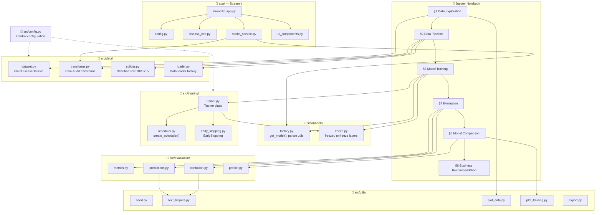
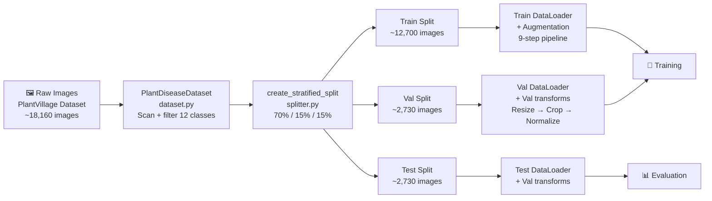
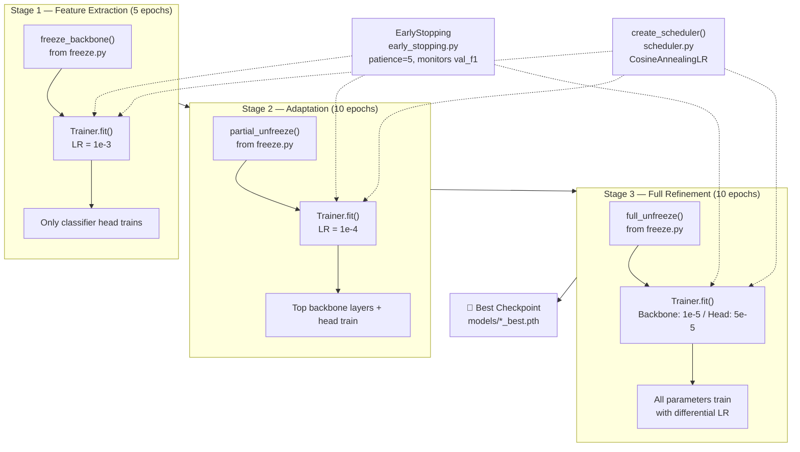
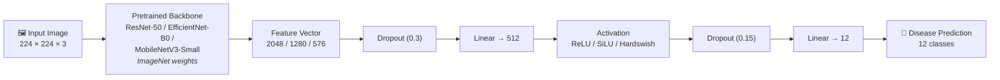
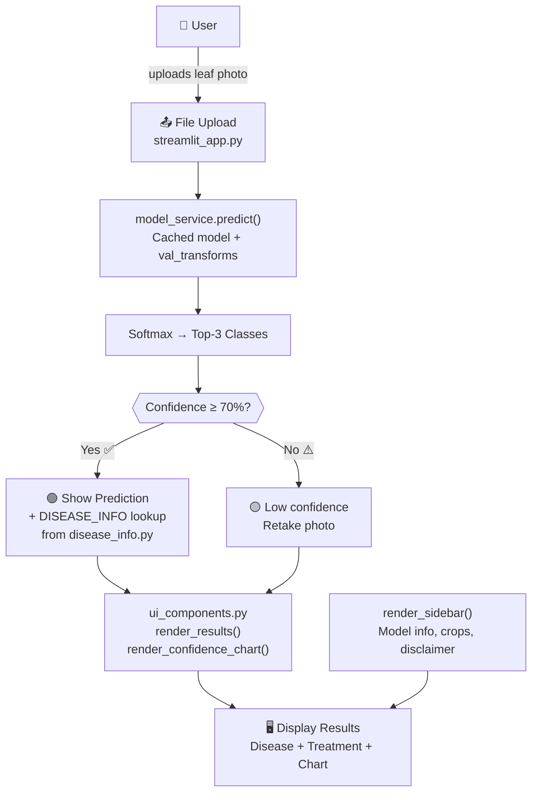
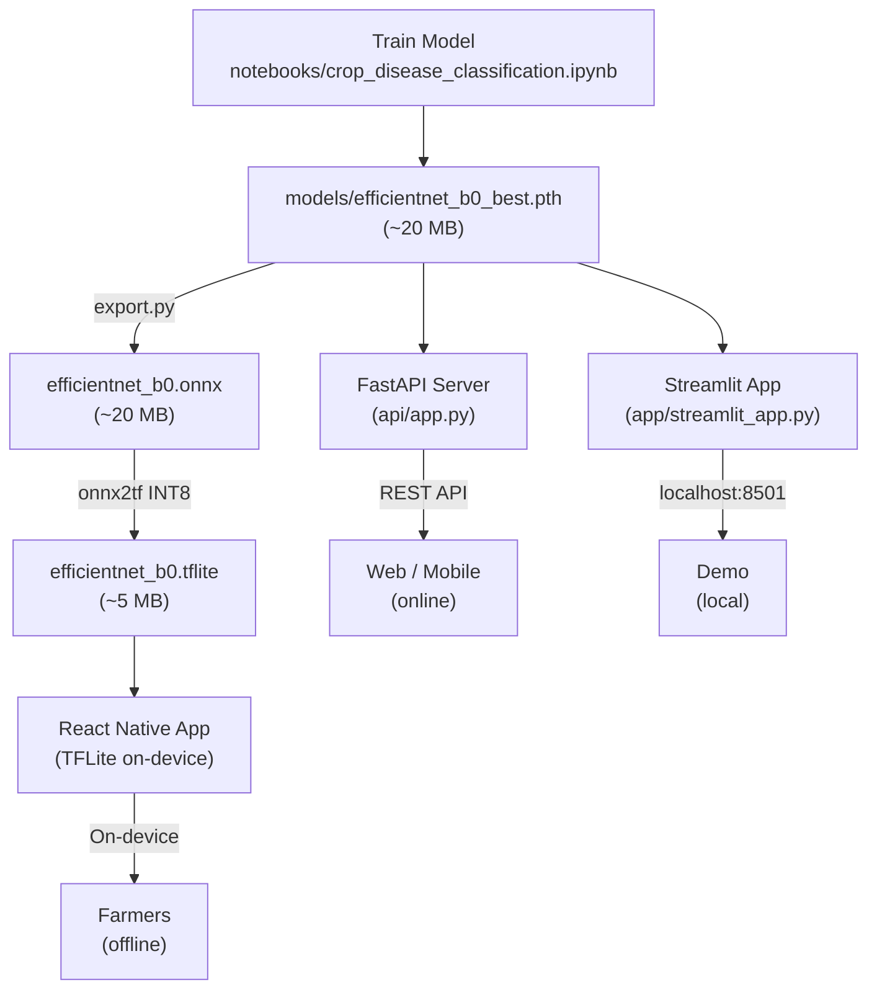

# 🏗️ Architecture Overview

[← Back to Home](Home.md)

This page explains how the project is organized, what each module does, and how data flows from raw images to disease predictions.

---

## High-Level Architecture

```
┌──────────────────────────────────────────────────────────────────────┐
│                        Jupyter Notebook                              │
│         (notebooks/crop_disease_classification.ipynb)                │
│                                                                      │
│  Orchestrates the entire pipeline by calling source modules:         │
│                                                                      │
│  ┌──────────┐   ┌──────────┐   ┌──────────┐   ┌──────────────────┐  │
│  │ §1 Data  │──▶│ §2 Data  │──▶│ §3 Model │──▶│ §4-§6 Evaluation │  │
│  │ Explore  │   │ Pipeline │   │ Training │   │ & Business       │  │
│  └──────────┘   └──────────┘   └──────────┘   └──────────────────┘  │
└──────────────────────────────────────────────────────────────────────┘
        │               │              │                │
        ▼               ▼              ▼                ▼
  ┌──────────┐   ┌───────────┐  ┌───────────┐   ┌───────────────┐
  │ src/data │   │ src/data  │  │src/models │   │src/evaluation │
  │dataset.py│   │transforms │  │ factory.py│   │  metrics.py   │
  │          │   │splitter.py│  │ freeze.py │   │  confusion.py │
  │          │   │ loader.py │  │           │   │predictions.py │
  │          │   │           │  │src/train  │   │  profiler.py  │
  └──────────┘   └───────────┘  │ trainer.py│   └───────────────┘
                     │          │scheduler  │          │
                     ▼          │early_stop │          ▼
              ┌──────────────┐  └───────────┘   ┌──────────┐
              │  src/utils   │        │         │ outputs/  │
              │  seed.py     │        ▼         │ *.png     │
              │text_helpers  │  ┌──────────┐    │(runtime)  │
              │ plot_data    │  │  models/  │    └──────────┘
              │plot_training │  │*.pth files│
              │  export.py   │  │ (runtime) │
              └──────────────┘  └──────────┘

              ┌──────────────────────────────────────────┐
              │            Streamlit App (app/)           │
              │  streamlit_app.py  ←  entry point         │
              │  config.py  ←  constants & thresholds     │
              │  disease_info.py  ←  disease database     │
              │  model_service.py  ← loading & prediction │
              │  ui_components.py  ← sidebar, results     │
              └──────────────────────────────────────────┘

              ┌──────────────────────────────────────────┐
              │         tests/ (78 passing, 1 skipped)    │
              │  Unit tests for config, data, models,    │
              │  training (scheduler, early stopping),   │
              │  text helpers, ONNX export, API          │
              └──────────────────────────────────────────┘
```

> **Note:** `models/` and `outputs/` directories are created at runtime during training. They are not tracked in version control.

---

## Mermaid Architecture Diagrams

### Overall Project Architecture



### Data Pipeline Flow



### Three-Stage Training Pipeline



### Model Architecture (per CNN)



### Streamlit App Flow



---

## Module Responsibilities

### 📁 `src/config.py` — Central Configuration

**Purpose:** Single source of truth for ALL hyperparameters and settings.

| Dataclass | What It Controls |
|-----------|-----------------|
| `DataConfig` | Dataset path, 12 selected classes, split ratios (70/15/15), image size (224), random seed (42) |
| `TrainConfig` | Batch size (32), learning rates per stage, epochs per stage, weight decay, label smoothing, early stopping patience, scheduler/optimizer choice, gradient clip norm |
| `ModelConfig` | Architecture name, pretrained flag, dropout rate (0.3), num_classes (12) |
| `Config` | Master container combining all three; validates consistency in `__post_init__` |

**Why it matters:** Zero magic numbers anywhere else. Change a value in `config.py` and the entire pipeline uses it.

---

### 📁 `src/data/` — Data Pipeline

| File | Responsibility |
|------|---------------|
| `dataset.py` | `PlantDiseaseDataset(Dataset)` — scans folder-per-class directory layout, filters by selected classes, builds deterministic `class_to_idx` mapping, validates image extensions |
| `transforms.py` | `get_train_transforms()` — 9-step augmentation pipeline (crop, flip, rotate, color, blur, erase). `get_val_transforms()` — deterministic resize + center-crop + normalize |
| `splitter.py` | `create_stratified_split()` — two-stage sklearn `train_test_split` to achieve exact 70/15/15 with stratification preserved |
| `loader.py` | `SplitDataset` wrapper, `create_dataloaders()` — creates train/val/test DataLoaders with appropriate shuffle/drop_last settings |

**Data Flow:**

```
Raw images on disk
        │
        ▼
PlantDiseaseDataset   ← scans folders, builds (path, label) list
        │
        ▼
create_stratified_split  ← splits list into train/val/test
        │
        ▼
create_dataloaders   ← wraps in DataLoaders with transforms applied on-the-fly
        │
        ▼
(images, labels) batches → ready for training
```

---

### 📁 `src/models/` — Model Creation & Freezing

**Purpose:** Create CNN models with custom classifier heads and manage layer freezing for progressive fine-tuning.

| File | Responsibility |
|------|---------------|
| `factory.py` | `get_model()` — loads pretrained backbone, replaces classifier head. `get_differential_lr_params()` for differential LR. Architecture registry (`_MODEL_REGISTRY`) |
| `freeze.py` | `freeze_backbone()`, `partial_unfreeze()`, `full_unfreeze()` — progressive layer freezing. `_CLASSIFIER_ATTR` registry maps architecture names to their classifier attribute names |

**Supported Architectures:**

| Architecture | Backbone Output | Activation | Model Size |
|-------------|----------------|------------|-----------|
| ResNet-50 | 2048 features | ReLU | ~98 MB |
| EfficientNet-B0 | 1280 features | SiLU (Swish) | ~20 MB |
| MobileNetV3-Small | 576 features | Hardswish | ~10 MB |

**Custom Classifier Head** (same for all architectures):

```
Dropout(0.3) → Linear(in_features, 512) → Activation → Dropout(0.15) → Linear(512, 12)
```

**Layer Freezing Functions** (in `freeze.py`):

| Function | Stage | What's Trainable |
|----------|-------|-----------------|
| `freeze_backbone()` | Stage 1 | Classifier head only |
| `partial_unfreeze()` | Stage 2 | Top backbone layers + classifier |
| `full_unfreeze()` | Stage 3 | Everything (with differential LR) |

---

### 📁 `src/training/` — Training Engine

**Purpose:** Complete training loop with early stopping, LR scheduling, checkpointing, and mixed precision.

| File | Responsibility |
|------|---------------|
| `trainer.py` | `Trainer` class — training/validation loop, checkpointing, AMP, gradient clipping, metric tracking |
| `scheduler.py` | `create_scheduler()` — factory function that creates `CosineAnnealingLR` from config |
| `early_stopping.py` | `EarlyStopping` class — monitors val_f1, tracks patience counter, exposes `.improved` property |

**Key Features:**

| Feature | How It Works |
|---------|-------------|
| **Loss Function** | `CrossEntropyLoss(label_smoothing=0.1)` — prevents overconfidence |
| **Optimizer** | `AdamW` with decoupled weight decay (1e-4) |
| **LR Scheduler** | `create_scheduler()` → Cosine annealing (warm to cold over epoch budget) |
| **Gradient Clipping** | `clip_grad_norm_(max_norm=1.0)` — prevents exploding gradients |
| **Mixed Precision** | AMP on CUDA for 2x memory savings; auto-disabled on MPS/CPU |
| **Early Stopping** | `EarlyStopping` class tracks `val_f1`; stops after 5 epochs without improvement |
| **Checkpointing** | Saves `{model_name}_best.pth` whenever val_f1 improves |
| **Metrics** | Uses `torchmetrics` for efficient GPU-side accuracy/F1 computation |

**Training Flow (per call to `trainer.fit()`):**

```
For each epoch:
  1. Train one epoch → compute train_loss, train_acc
  2. Validate → compute val_loss, val_acc, val_f1
  3. Step the LR scheduler (from scheduler.py)
  4. If val_f1 improved → save checkpoint (EarlyStopping.improved)
  5. If patience exceeded → early stop (EarlyStopping.step())
  6. Log all metrics to history dict
```

---

### 📁 `src/evaluation/` — Model Evaluation

| File | What It Does |
|------|-------------|
| `metrics.py` | `compute_predictions()` — runs model on full dataset, returns (preds, labels, probs). `generate_classification_report()` — sklearn report per class. `compute_summary_metrics()` — accuracy + F1 macro + F1 weighted |
| `confusion.py` | `plot_confusion_matrix()` — row-normalized heatmap showing where the model confuses classes |
| `predictions.py` | `get_prediction_examples()` — collects correct/incorrect predictions with confidence. `plot_prediction_grid()` — visual grid with green (correct) / red (incorrect) titles |
| `profiler.py` | `profile_model()` — measures inference latency (mean + P95), GPU timing, model file size on disk |

---

### 📁 `src/utils/` — Utilities

| File | What It Does |
|------|-------------|
| `seed.py` | `set_seed(42)` — sets random, numpy, torch, cuda seeds + deterministic cuDNN for full reproducibility |
| `text_helpers.py` | `shorten_class_name()` — extracts disease portion from long folder names (used by confusion matrix & predictions). `get_crop_name()` — extracts crop type from class name |
| `plot_data.py` | `plot_sample_images()` — grid of samples. `plot_class_distribution()` — bar chart color-coded by crop. `plot_augmentation_examples()` — before/after augmentation comparison |
| `plot_training.py` | `plot_training_curves()` — 2×2 grid (loss/accuracy/f1/lr) with stage boundaries. `plot_model_comparison()` — scatter plots (accuracy vs latency, accuracy vs size) |
| `export.py` | `export_to_onnx()` — converts a trained PyTorch model to ONNX format. `load_checkpoint_and_export()` — loads a checkpoint and exports end-to-end |

---

### 📁 `app/` — Web Application (5 Modules)

**Purpose:** Interactive demo where users upload leaf images and get disease predictions with treatment recommendations.

| File | Responsibility |
|------|---------------|
| `streamlit_app.py` | Entry point — orchestrates page layout, wires sidebar + main area |
| `config.py` | Constants: paths, thresholds (70% confidence), UI colours, supported extensions |
| `disease_info.py` | `DISEASE_INFO` database (12 entries) + `DEFAULT_INFO` fallback + lookup helpers |
| `model_service.py` | `load_model()` with `@st.cache_resource`, `Prediction` dataclass, `predict()` function |
| `ui_components.py` | `render_sidebar()`, `render_results()`, `render_confidence_chart()` widgets |

```
User uploads image
        │
        ▼
model_service.predict()  ← loads cached model, applies val_transforms
        │
        ▼
model(image_tensor)  ← forward pass through loaded checkpoint
        │
        ▼
softmax → top-3 classes with probabilities → Prediction dataclass
        │
        ▼
disease_info.DISEASE_INFO[class]  ← look up crop, disease, severity, action, product
        │
        ▼
ui_components: prediction card + confidence bar chart + treatment recommendation
```

---

### 📁 `api/` — FastAPI REST API (SOLID Architecture)

**Purpose:** Production-grade REST API for online model inference, built with SOLID principles.

| File | Responsibility | SOLID Principle |
|------|---------------|-----------------|
| `app.py` | Application factory — creates FastAPI app, wires middleware + routes | SRP |
| `schemas.py` | Pydantic request/response models (`PredictionResponse`, `HealthResponse`) | SRP |
| `protocols.py` | Abstract interfaces (`InferenceService`, `DiseaseInfoService`) | DIP, ISP |
| `dependencies.py` | FastAPI dependency injection — wires concrete services to protocols | DIP |
| `middleware.py` | CORS configuration + request timing middleware | SRP |
| `routes/health.py` | `GET /health`, `GET /model/version` endpoints | ISP |
| `routes/predict.py` | `POST /predict` — image upload → disease prediction | ISP |
| `services/inference_service.py` | PyTorch model loading & prediction (loads checkpoint, applies transforms) | SRP, OCP |
| `services/disease_service.py` | Disease information enrichment (crop, treatment, severity) | SRP, OCP |

**API Flow:**

```
Client uploads image (multipart/form-data)
        │
        ▼
POST /predict endpoint  ← routes/predict.py
        │
        ▼
InferenceService.predict()  ← services/inference_service.py
  Applies val_transforms, model forward pass, softmax, top-K
        │
        ▼
DiseaseInfoService.enrich()  ← services/disease_service.py
  Looks up crop, disease, severity, treatment for predicted class
        │
        ▼
PredictionResponse  ← schemas.py (Pydantic model)
        │
        ▼
JSON response to client
```

---

### 📁 `scripts/` — CLI Utilities

| File | Responsibility |
|------|---------------|
| `export_model.py` | CLI pipeline: PyTorch → ONNX → TFLite with INT8 quantization. Supports `--model-name`, `--checkpoint`, `--output-dir` arguments |

---

## How Modules Connect

Here is the dependency graph (who imports whom):

```
config.py ←───── used by everything

dataset.py ←─── transforms.py (indirectly, transforms passed as arg)
                 splitter.py (receives dataset.samples)
                 loader.py (wraps split data into DataLoaders)

factory.py ←─── freeze.py (_CLASSIFIER_ATTR shared registry)
                 trainer.py (model passed to Trainer)

freeze.py  ←─── trainer.py (freeze_backbone, partial_unfreeze, full_unfreeze)

scheduler.py ←── trainer.py (create_scheduler)
early_stopping.py ←── trainer.py (EarlyStopping)

trainer.py ←─── notebook §3 (calls trainer.fit() for each stage)

metrics.py ←─── notebook §4 (evaluation on test set)
confusion.py ←── text_helpers.py (shorten_class_name)
predictions.py ←── text_helpers.py (shorten_class_name)
profiler.py

text_helpers.py ←── confusion.py, predictions.py
plot_data.py    ←── notebook §1, §2 (data exploration plots)
plot_training.py ←── notebook §3, §5 (training curves, model comparison)

app/streamlit_app.py ←── app/config.py + app/disease_info.py
                         app/model_service.py (loads factory.py + transforms.py)
                         app/ui_components.py
```

---

## Design Principles

1. **Modular**: Each file does one thing. You can swap the model, change augmentations, or adjust metrics independently.
2. **Configurable**: All settings are in `config.py`. No hardcoded values scattered in code.
3. **Reproducible**: Fixed seeds + deterministic operations = same results every run.
4. **Progressive**: Three-stage training preserves pretrained knowledge while adapting to the new task.
5. **Production-oriented**: The Streamlit app shows how the model could be deployed in the field.
6. **Tested**: 78 unit tests (1 skipped) cover config, data, models, training, utils, export, and API.
7. **Deployment-ready**: FastAPI server + Docker + TFLite export pipeline included (see [Deployment Guide](Deployment-Guide.md)).
8. **SOLID API**: The REST API follows SRP, OCP, DIP, and ISP with protocol-based dependency injection.

---

## Deployment Architecture

The trained model reaches end users through three channels:



> See [Deployment Guide](Deployment-Guide.md) for full implementation details and the [Task Walkthrough Part 5 & 6](Task-Walkthrough.md) for deployment and MLOps requirements.

---

## Next Steps

| What | Where |
|------|-------|
| Walk through every requirement (end-to-end) | [Task Walkthrough](Task-Walkthrough.md) |
| Deep dive into augmentations and splitting | [Data Pipeline](Data-Pipeline.md) |
| Understand the three-stage fine-tuning | [Model Training](Model-Training.md) |
| Interpret evaluation results | [Evaluation & Metrics](Evaluation-and-Metrics.md) |
| See the Streamlit demo app | [Streamlit App](Streamlit-App.md) |
| Deploy to production (API or mobile) | [Deployment Guide](Deployment-Guide.md) |
| Deploy for free on the cloud | [Cloud Deployment](Cloud-Deployment.md) |
| Fix common issues | [FAQ & Troubleshooting](FAQ-and-Troubleshooting.md) |
