# ☁️ Cloud Deployment — Free Hosting Options

[← Back to Home](Home.md)

This guide covers **free cloud platforms** where you can deploy the Crop Disease Classification app so evaluators, teammates, or the public can test it live — **no local setup required**.

---

## Platform Comparison

| Platform | Best For | Free Tier | Persistent | Custom Domain | Setup Time |
|----------|----------|-----------|------------|---------------|------------|
| **Streamlit Community Cloud** | Streamlit app (demo) | ✅ Unlimited | ❌ (ephemeral) | ❌ | ~5 min |
| **Hugging Face Spaces** | Streamlit / Gradio / Docker app | ✅ 2 vCPU, 16 GB RAM | ❌ (ephemeral) | ✅ (subdomain) | ~10 min |
| **Render** | FastAPI REST API | ✅ 750 hrs/month | ❌ (ephemeral) | ✅ | ~10 min |

> **Recommendation:** Deploy the **Streamlit app on Streamlit Community Cloud** (easiest, purpose-built) and optionally the **FastAPI API on Render** for the REST endpoint.

---

## Table of Contents

1. [Option 1 — Streamlit Community Cloud (Recommended)](#option-1--streamlit-community-cloud-recommended)
2. [Option 2 — Hugging Face Spaces](#option-2--hugging-face-spaces)
3. [Option 3 — Render (FastAPI)](#option-3--render-fastapi)
4. [Model Checkpoint Strategy](#model-checkpoint-strategy)
5. [Architecture Diagram](#architecture-diagram)
6. [Troubleshooting](#troubleshooting)

---

## Option 1 — Streamlit Community Cloud (Recommended)

[Streamlit Community Cloud](https://streamlit.io/cloud) is the **easiest** option. It's built specifically for Streamlit apps, deploys from GitHub in one click, and is **completely free**.

### Prerequisites

- GitHub account
- Project pushed to a **public** GitHub repository
- A trained model checkpoint (`.pth` file)

### Step-by-Step Deployment

#### Step 1 — Push Project to GitHub

```bash
cd crop-disease

# Initialize git if not already done
git init
git remote add origin https://github.com/<your-username>/crop-disease.git

# Add all files (models/ is excluded by .gitignore)
git add .
git commit -m "Initial commit: crop disease classifier"
git push -u origin main
```

#### Step 2 — Handle the Model Checkpoint

Streamlit Community Cloud **cannot run training** (no GPU, limited resources). You need to provide a pre-trained checkpoint. Two approaches:

**Option A — Git LFS (recommended for small models)**

```bash
# Install Git LFS
git lfs install

# Track .pth files
git lfs track "models/*.pth"
git add .gitattributes
git add models/efficientnet_b0_best.pth   # ~20 MB
git commit -m "Add trained checkpoint via Git LFS"
git push
```

> GitHub provides 1 GB free LFS storage — sufficient for EfficientNet-B0 (~20 MB).

**Option B — Download from URL at startup**

Add a download helper to `app/model_service.py` that fetches the checkpoint from a public URL (Google Drive, Hugging Face Hub, etc.) on first load:

```python
import urllib.request
from pathlib import Path

CHECKPOINT_URL = "https://huggingface.co/<user>/crop-disease-model/resolve/main/efficientnet_b0_best.pth"
CHECKPOINT_PATH = Path("models/efficientnet_b0_best.pth")

def ensure_checkpoint():
    """Download checkpoint if not present."""
    if not CHECKPOINT_PATH.exists():
        CHECKPOINT_PATH.parent.mkdir(parents=True, exist_ok=True)
        urllib.request.urlretrieve(CHECKPOINT_URL, CHECKPOINT_PATH)
```

#### Step 3 — Deploy on Streamlit Community Cloud

1. Go to [share.streamlit.io](https://share.streamlit.io)
2. Sign in with your **GitHub** account
3. Click **"Create app"**
4. Fill in the deployment form:

   | Field | Value |
   |-------|-------|
   | Repository | `<your-username>/crop-disease` |
   | Branch | `main` |
   | Main file path | `app/streamlit_app.py` |

5. Click **"Deploy!"**

The app will build (install `requirements.txt` dependencies) and go live at:

```
https://<your-username>-crop-disease-appstreamlit-app-<hash>.streamlit.app
```

#### Step 4 — Verify

- Open the URL in your browser
- Upload a test leaf image
- Confirm the prediction + treatment recommendation appear

### Streamlit Cloud Limits

| Resource | Limit |
|----------|-------|
| Apps | Unlimited public apps |
| RAM | ~1 GB per app |
| CPU | Shared |
| Disk | Ephemeral (lost on reboot) |
| Sleep | App sleeps after inactivity; wakes on next visit (~30s cold start) |
| Builds | Automatic on every `git push` |

### Streamlit Cloud Tips

- Add a `packages.txt` file if you need system-level apt packages
- Use `st.cache_resource` (already done in our app) to avoid reloading the model on every rerun
- Keep `requirements.txt` minimal — install only what the Streamlit app needs
- The app will auto-update whenever you push to the GitHub branch
- The project ships `.streamlit/config.toml` with headless mode, upload size limit, and a green theme — auto-detected by Streamlit Cloud

---

## Option 2 — Hugging Face Spaces

[Hugging Face Spaces](https://huggingface.co/spaces) offers free hosting with **2 vCPU and 16 GB RAM** — generous enough to run PyTorch inference.

### Step-by-Step Deployment

#### Step 1 — Create a Hugging Face Account

Sign up at [huggingface.co/join](https://huggingface.co/join).

#### Step 2 — Create a New Space

1. Go to [huggingface.co/new-space](https://huggingface.co/new-space)
2. Fill in the form:

   | Field | Value |
   |-------|-------|
   | Space name | `crop-disease-classifier` |
   | SDK | **Docker** (recommended for Streamlit apps; native Streamlit SDK is deprecated on HF) |
   | Hardware | **CPU Basic (Free)** |
   | Visibility | Public |

3. Click **"Create Space"**

#### Step 3 — Prepare the Repository

Clone the space and copy your project files:

```bash
git clone https://huggingface.co/spaces/<your-username>/crop-disease-classifier
cd crop-disease-classifier

# Copy project files
cp -r /path/to/crop-disease/{src,app,models,requirements.txt,.streamlit} .

# Use the existing HF-specific Dockerfile (rename to Dockerfile)
cp /path/to/crop-disease/Dockerfile.hf ./Dockerfile
```

Create a `README.md` with Hugging Face metadata:

```yaml
---
title: Crop Disease Classifier
emoji: 🌿
colorFrom: green
colorTo: yellow
sdk: docker
pinned: false
---
```

#### Step 4 — Upload Model to Hugging Face Hub

```bash
# Install huggingface_hub CLI
pip install huggingface_hub

# Upload checkpoint to your space (via Git LFS)
git lfs install
git lfs track "models/*.pth"
git add .
git commit -m "Add crop disease classifier"
git push
```

#### Step 5 — Access Your App

Your app will be live at:

```
https://<your-username>-crop-disease-classifier.hf.space
```

### Hugging Face Spaces Limits

| Resource | Free Tier |
|----------|-----------|
| CPU | 2 vCPU |
| RAM | 16 GB |
| Disk | 50 GB (not persistent) |
| Sleep | Sleeps after inactivity; wakes on next visit |
| GPU | Not included (paid upgrade available) |
| Build | Automatic on every `git push` |

### Hugging Face Tips

- **16 GB RAM** is more than enough for PyTorch inference with EfficientNet-B0
- You can upload the model as a separate Hugging Face model repo and download it at startup
- Hugging Face provides **git LFS** for large files (model checkpoints)
- The Docker SDK gives you the most control over the environment

---

## Option 3 — Render (FastAPI)

[Render](https://render.com) is ideal for deploying the **FastAPI REST API**. The free tier provides 750 instance hours per month.

### Step-by-Step Deployment

#### Step 1 — Push to GitHub

Ensure your project is on GitHub (same repo used for Streamlit Community Cloud works).

#### Step 2 — Create a Render Account

Sign up at [dashboard.render.com/register](https://dashboard.render.com/register).

#### Step 3 — Create a New Web Service

**Option A — One-click Blueprint (recommended):**

The project includes a `render.yaml` Blueprint that automates deployment:

1. Go to [dashboard.render.com/blueprints/new](https://dashboard.render.com/blueprints/new)
2. Connect your GitHub repo
3. Render reads `render.yaml` and auto-configures name, plan, port, and health check
4. Click **"Apply"**

**Option B — Manual setup:**

1. Click **"New" → "Web Service"** in the Render Dashboard
2. Connect your GitHub repository
3. Configure:

   | Setting | Value |
   |---------|-------|
   | Name | `crop-disease-api` |
   | Region | Oregon (US West) or closest to you |
   | Branch | `main` |
   | Runtime | **Docker** |
   | Instance Type | **Free** |

4. Click **"Deploy Web Service"**

Render will build from your existing `Dockerfile` and deploy automatically.

#### Step 4 — Test the API

```bash
# Health check
curl https://crop-disease-api.onrender.com/health

# Predict
curl -X POST "https://crop-disease-api.onrender.com/predict" \
  -F "file=@leaf_photo.jpg"
```

API docs available at: `https://crop-disease-api.onrender.com/docs`

### Render Free Tier Limits

| Resource | Limit |
|----------|-------|
| Instance hours | 750/month (~31 days) |
| RAM | 512 MB |
| CPU | 0.1 vCPU |
| Disk | Ephemeral |
| Sleep | Spins down after 15 min of inactivity; ~30-60s cold start |
| Bandwidth | 100 GB/month outbound |
| Custom domain | ✅ (free with HTTPS) |

### Render Tips

- The **512 MB RAM** limit on Render's free tier is tight for PyTorch (~400 MB for EfficientNet-B0). Consider using **ONNX Runtime** instead of full PyTorch to reduce memory:
  ```bash
  pip install onnxruntime  # ~50 MB vs ~800 MB for torch
  ```
- Render's free tier spins down after 15 min — first request after sleep takes ~60s
- You can keep the service alive with a free uptime monitor (e.g., UptimeRobot)
- Docker builds are supported natively

---

## Model Checkpoint Strategy

Since free cloud platforms have **ephemeral storage** (files are lost on restart), you need a strategy for model checkpoints:

| Strategy | Pros | Cons | Best For |
|----------|------|------|----------|
| **Git LFS** | Simple, version-controlled | 1 GB free limit on GitHub | Models < 50 MB (EfficientNet-B0 ✅) |
| **Hugging Face Hub** | Unlimited LFS, good for ML | Requires HF account | Any model size |
| **Google Drive URL** | Unlimited size | Fiddly share URLs, rate limits | Quick demos |
| **Cloud Storage (S3/GCS)** | Reliable, fast | May require paid account | Production |

### Recommended Approach

For this project, use **Git LFS** for EfficientNet-B0 (~20 MB). It's well within GitHub's free 1 GB LFS quota and requires no external services.

```bash
git lfs install
git lfs track "models/efficientnet_b0_best.pth"
git lfs track "models/class_mapping.json"
git add .gitattributes models/
git commit -m "Add trained model via Git LFS"
git push
```

---

## Architecture Diagram

```mermaid
flowchart TD
    subgraph GitHub["GitHub Repository"]
        Code["Source Code"]
        Model["Model Checkpoint<br/>(Git LFS)"]
    end

    subgraph StreamlitCloud["Streamlit Community Cloud"]
        SApp["🌿 Streamlit App<br/>app/streamlit_app.py"]
    end

    subgraph HuggingFace["Hugging Face Spaces"]
        HFApp["🌿 Streamlit App (Docker)<br/>Port 7860"]
    end

    subgraph RenderCloud["Render"]
        API["⚡ FastAPI API<br/>Port 8000"]
    end

    Code -->|"auto-deploy"| SApp
    Code -->|"auto-deploy"| HFApp
    Code -->|"Docker build"| API

    SApp -->|"https://*.streamlit.app"| Users1["👤 Evaluators<br/>(Web Browser)"]
    HFApp -->|"https://*.hf.space"| Users2["👤 Community<br/>(Web Browser)"]
    API -->|"REST API"| Users3["💻 Developers<br/>(curl / Postman)"]
```



---

## Deployment Checklist

Before deploying, verify the following:

- [ ] All 78 tests pass: `python -m pytest tests/ -v`
- [ ] Streamlit app runs locally: `streamlit run app/streamlit_app.py`
- [ ] FastAPI runs locally: `uvicorn api.app:app --reload`
- [ ] Model checkpoint exists: `models/efficientnet_b0_best.pth`
- [ ] `class_mapping.json` exists: `models/class_mapping.json`
- [ ] `requirements.txt` is up to date
- [ ] `.gitignore` excludes `.venv/`, `__pycache__/`, `outputs/`
- [ ] Project pushed to GitHub

---

## Troubleshooting

### Streamlit Cloud: "ModuleNotFoundError"

The app can't find project modules. Ensure `app/streamlit_app.py` imports use the correct paths. Streamlit Community Cloud runs from the repo root, so `from app.config import ...` should work.

### Streamlit Cloud: App crashes on model load

Free tier RAM (~1 GB) may be insufficient for large models. Use **EfficientNet-B0** (~20 MB in memory) instead of ResNet-50 (~98 MB). Our app already prioritizes EfficientNet.

### Hugging Face Spaces: Build fails

Check the build logs in the Space's "Logs" tab. Common issues:
- Missing dependencies → update `requirements.txt`
- Port mismatch → Ensure the Dockerfile exposes port **7860** (HF requirement)

### Render: Out of memory

Render's free tier only has **512 MB RAM**. PyTorch itself is ~400 MB. Options:
1. Switch to ONNX Runtime for inference (~50 MB)
2. Upgrade to the Starter plan ($7/month, 512 MB guaranteed)
3. Use Render only for the FastAPI API, and Streamlit Cloud for the demo

### General: Model not found after deploy

Free platforms have **ephemeral storage**. Ensure the model is either:
- In the Git repo (via Git LFS)
- Downloaded at startup from a URL
- Baked into the Docker image

---

## Cost Summary

| Deployment | Monthly Cost | What You Get |
|-----------|-------------|-------------|
| Streamlit Community Cloud | **$0** | Streamlit demo app, auto-deploy from GitHub |
| Hugging Face Spaces (CPU) | **$0** | Docker-based app, 2 vCPU / 16 GB RAM |
| Render (Free) | **$0** | FastAPI REST API, 750 hrs/month |
| **Total** | **$0** | Full demo + API hosted for free |

---

## Next Steps

| What | Where |
|------|-------|
| Step-by-step sharing plan | [Sharing Plan](Sharing-Plan.md) |
| Full deployment architecture | [Deployment Guide](Deployment-Guide.md) |
| Local setup guide | [Getting Started](Getting-Started.md) |
| Wiki index | [Home](Home.md) |
