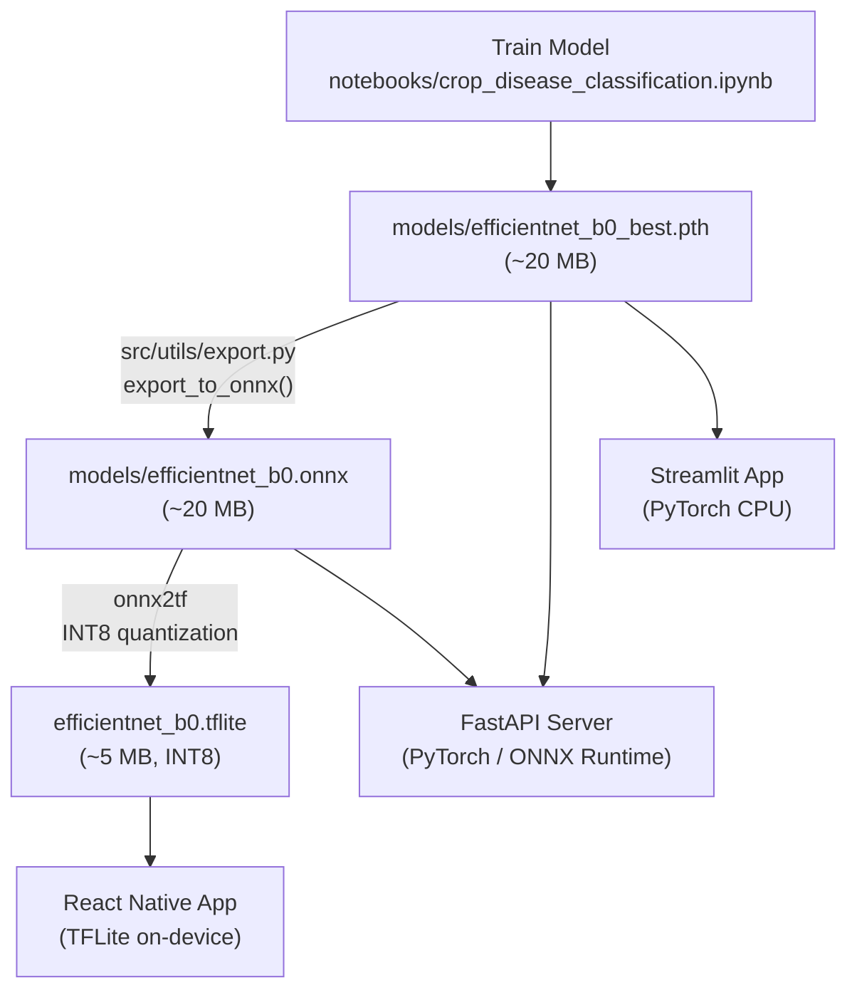
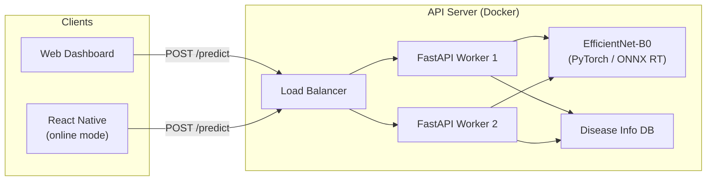
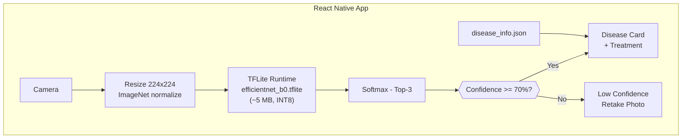
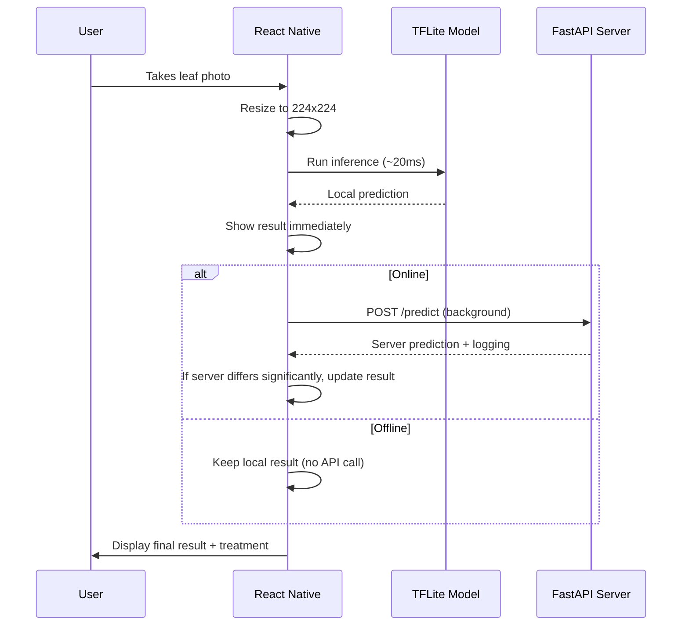

# 🚀 Deployment Guide — Online API & Offline React Native (TFLite)

[← Back to Home](Home.md)

This document covers **two deployment approaches** for the trained crop disease classification model:

| Approach | Use Case | Connectivity | Latency | Model Format |
|----------|----------|-------------|---------|-------------|
| **Online (REST API)** | Web app, dashboard, third-party integrations, React Native when connected | Internet required | ~100–300 ms | PyTorch `.pth` / ONNX on server |
| **Offline (React Native + TFLite)** | Field use, rural areas, no-connectivity environments | No internet | ~15–50 ms | TFLite `.tflite` on device (~5 MB) |

Both approaches are designed to work together — the React Native app uses **TFLite offline by default** and falls back to the **API when connected** for logging and model sync.

---

## Table of Contents

1. [Model Export Pipeline](#model-export-pipeline)
2. [Approach 1 — Online via REST API](#approach-1--online-via-rest-api)
3. [Approach 2 — Offline React Native with TFLite](#approach-2--offline-react-native-with-tflite)
4. [Hybrid Strategy — Offline-First with API Sync](#hybrid-strategy--offline-first-with-api-sync)
5. [Shared Components](#shared-components)
6. [Architecture Diagrams](#architecture-diagrams)
7. [Comparison & Implementation Plan](#comparison--implementation-plan)

---

## Model Export Pipeline

The project already provides ONNX export support via `src/utils/export.py`. The pipeline converts the trained PyTorch checkpoint into a lightweight TFLite model suitable for mobile.

### Step 1 — PyTorch → ONNX

```python
from src.utils.export import load_checkpoint_and_export

# Export the recommended model (EfficientNet-B0)
onnx_path = load_checkpoint_and_export(
    checkpoint_path="models/efficientnet_b0_best.pth",
    model_name="efficientnet_b0",
    num_classes=12,
    output_path="models/efficientnet_b0.onnx",
)
# Output: models/efficientnet_b0.onnx (~20 MB)
```

### Step 2 — ONNX → TFLite (with INT8 quantization)

```bash
pip install onnx2tf tensorflow

python -c "
import onnx2tf

onnx2tf.convert(
    input_onnx_file_path='models/efficientnet_b0.onnx',
    output_folder_path='models/tflite/',
    output_integer_quantized_tflite=True,
)
"
# Output: models/tflite/efficientnet_b0_integer_quant.tflite (~5 MB)
```

> **INT8 quantization** reduces the model from ~20 MB to ~5 MB with minimal accuracy loss (<0.5%). The smaller model loads faster and uses less battery on mobile devices.

### Alternative — Direct PyTorch → TFLite via `ai-edge-torch`

```bash
pip install ai-edge-torch

python -c "
import torch
import ai_edge_torch
from src.models.factory import get_model

model = get_model('efficientnet_b0', num_classes=12, pretrained=False, dropout=0.3)
ckpt = torch.load('models/efficientnet_b0_best.pth', map_location='cpu', weights_only=True)
model.load_state_dict(ckpt['model_state_dict'])
model.eval()

sample = torch.randn(1, 3, 224, 224)
edge_model = ai_edge_torch.convert(model, (sample,))
edge_model.export('models/efficientnet_b0.tflite')
"
```

### Export Summary

| Step | Format | File | Size | Purpose |
|------|--------|------|------|---------|
| Training output | PyTorch `.pth` | `efficientnet_b0_best.pth` | ~20 MB | API server inference |
| Intermediate | ONNX `.onnx` | `efficientnet_b0.onnx` | ~20 MB | Conversion bridge / ONNX Runtime API |
| Mobile deploy | TFLite `.tflite` | `efficientnet_b0_integer_quant.tflite` | ~5 MB | React Native offline inference |

```
PyTorch (.pth)  →  ONNX (.onnx)  →  TFLite (.tflite, INT8)
    ~20 MB            ~20 MB              ~5 MB
```

---

## Approach 1 — Online via REST API

### Overview

The model runs on a **server** and clients send images over HTTP. Best when:
- You need centralized model updates (deploy once, all clients benefit)
- You want to log predictions for monitoring, analytics, and retraining
- Processing images from web dashboards or third-party integrations

### Server Architecture

```
┌──────────────────┐     HTTPS      ┌───────────────────────────────────┐
│  React Native /  │ ─────────────▶ │         API Server (FastAPI)      │
│  Web App /       │ ◀───────────── │                                   │
│  Third-Party     │   JSON response │  ┌─────────────┐ ┌────────────┐  │
└──────────────────┘                 │  │ Model       │ │ Disease    │  │
                                     │  │ Service     │ │ Info DB    │  │
                                     │  │ (PyTorch /  │ │            │  │
                                     │  │  ONNX RT)   │ │ 12 classes │  │
                                     │  └─────────────┘ └────────────┘  │
                                     └───────────────────────────────────┘
```

### FastAPI Implementation (SOLID Architecture)

The API follows **SOLID principles** for maintainability and testability:

```
api/
├── __init__.py              ← Package version
├── app.py                   ← Application factory (SRP)
├── schemas.py               ← Pydantic request/response models (SRP)
├── protocols.py             ← Abstract interfaces — InferenceService, DiseaseInfoService (DIP, ISP)
├── dependencies.py          ← FastAPI dependency injection with singleton services (DIP)
├── middleware.py             ← CORS, request logging/timing (OCP)
├── routes/
│   ├── health.py            ← GET /health, GET /model/version (ISP)
│   └── predict.py           ← POST /predict — image upload → disease prediction (SRP)
└── services/
    ├── inference_service.py ← PyTorch model loading & prediction (SRP, LSP)
    └── disease_service.py   ← Disease metadata enrichment (SRP, OCP)
```

| SOLID Principle | How It's Applied |
|----------------|-----------------|
| **Single Responsibility** | Each module has exactly one job |
| **Open/Closed** | Add ONNX Runtime backend without modifying routes |
| **Liskov Substitution** | PyTorch and ONNX services are interchangeable |
| **Interface Segregation** | Health and predict routes are separate modules |
| **Dependency Inversion** | Routes depend on protocols, not concrete classes |

**Application factory** (`api/app.py`):

```python
"""
Run with:  uvicorn api.app:app --host 0.0.0.0 --port 8000 --reload
"""
from fastapi import FastAPI
from api.middleware import register_middleware
from api.routes import health, predict

def create_app() -> FastAPI:
    application = FastAPI(
        title="Crop Disease Detection API",
        description="Upload a leaf image → get disease prediction + treatment",
        version="1.0.0",
    )
    register_middleware(application)
    application.include_router(health.router)
    application.include_router(predict.router)
    return application

app = create_app()
```

**Abstract protocols** (`api/protocols.py`) — Dependency Inversion:

```python
from typing import Dict, List, Protocol, runtime_checkable
from PIL import Image

@runtime_checkable
class InferenceService(Protocol):
    @property
    def model_name(self) -> str: ...
    @property
    def num_classes(self) -> int: ...
    def predict(self, image: Image.Image, top_k: int = 3) -> List[Dict]: ...

@runtime_checkable
class DiseaseInfoService(Protocol):
    def enrich(self, class_name: str) -> Dict[str, str]: ...
```

**Prediction route** (`api/routes/predict.py`) — depends on abstractions:

```python
from fastapi import APIRouter, Depends, File, HTTPException, UploadFile
from api.dependencies import get_disease_service, get_inference_service
from api.protocols import DiseaseInfoService, InferenceService

router = APIRouter(tags=["Prediction"])

@router.post("/predict", response_model=PredictionResponse)
async def predict_endpoint(
    file: UploadFile = File(...),
    inference: InferenceService = Depends(get_inference_service),
    disease_svc: DiseaseInfoService = Depends(get_disease_service),
) -> PredictionResponse:
    # Validate → decode → inference → enrich → respond
    ...
```

**Dependency injection** (`api/dependencies.py`) — swap implementations here:

```python
from functools import lru_cache
from api.services.inference_service import PyTorchInferenceService

@lru_cache(maxsize=1)
def get_inference_service() -> PyTorchInferenceService:
    return PyTorchInferenceService()  # Change to OnnxInferenceService for ONNX
```

### Additional Dependencies

```bash
pip install fastapi uvicorn python-multipart httpx  # httpx for testing
```

### Running the API

```bash
# Development (auto-reload)
uvicorn api.app:app --reload --host 0.0.0.0 --port 8000

# Production (multi-worker)
uvicorn api.app:app --host 0.0.0.0 --port 8000 --workers 4
```

Auto-generated API docs: `http://localhost:8000/docs` (Swagger UI)

### API Response Example

```json
{
  "model": "efficientnet_b0",
  "confident": true,
  "predictions": [
    {
      "class_name": "Tomato_Early_blight",
      "probability": 0.9234,
      "crop": "Tomato",
      "disease": "Early Blight",
      "severity": "Moderate",
      "action": "Apply fungicide at first sign. Remove lower infected leaves.",
      "product": "Score (Difenoconazole) or Mancozeb"
    },
    {
      "class_name": "Tomato_Late_blight",
      "probability": 0.0453,
      "crop": "Tomato",
      "disease": "Late Blight",
      "severity": "High -- Urgent",
      "action": "Apply systemic fungicide immediately.",
      "product": "Ridomil Gold MZ"
    },
    {
      "class_name": "Tomato_Septoria_leaf_spot",
      "probability": 0.0189,
      "crop": "Tomato",
      "disease": "Septoria Leaf Spot",
      "severity": "Moderate",
      "action": "Remove infected leaves. Apply fungicide.",
      "product": "Bravo (Chlorothalonil)"
    }
  ]
}
```

### Client Usage Examples

**cURL:**
```bash
curl -X POST "http://localhost:8000/predict" \
  -F "file=@leaf_photo.jpg" \
  | python -m json.tool
```

**Python:**
```python
import requests

resp = requests.post(
    "http://localhost:8000/predict",
    files={"file": open("leaf_photo.jpg", "rb")},
)
data = resp.json()

if data["confident"]:
    top = data["predictions"][0]
    print(f"{top['disease']} — {top['action']}")
else:
    print("Low confidence — retake photo")
```

**JavaScript (web dashboard):**
```javascript
const formData = new FormData();
formData.append("file", fileInput.files[0]);

const resp = await fetch("https://api.example.com/predict", {
  method: "POST",
  body: formData,
});
const data = await resp.json();

if (data.confident) {
  showResult(data.predictions[0]);
} else {
  showWarning("Low confidence. Please retake the photo.");
}
```

### Dockerizing the API

The project includes a **multi-stage Dockerfile** (build stage + slim runtime) and **docker-compose.yml**:

```dockerfile
# ---- Build stage ----
FROM python:3.11-slim AS builder
WORKDIR /build
COPY requirements-api.txt .
RUN pip install --no-cache-dir --prefix=/install -r requirements-api.txt

# ---- Runtime stage ----
FROM python:3.11-slim
WORKDIR /app
COPY --from=builder /install /usr/local
COPY src/ src/
COPY app/ app/
COPY api/ api/
COPY models/ models/
RUN adduser --disabled-password --no-create-home appuser
USER appuser
EXPOSE 8000
HEALTHCHECK --interval=30s --timeout=5s --start-period=30s --retries=3 \
    CMD python -c "import urllib.request; urllib.request.urlopen('http://localhost:${PORT:-8000}/health')" || exit 1
CMD ["sh", "-c", "uvicorn api.app:app --host 0.0.0.0 --port ${PORT:-8000} --workers 2"]
```

> **Note:** The `CMD` uses shell form so `$PORT` is expanded at runtime — this is required for cloud platforms like Render that inject a custom port via environment variable.

```bash
# Build and run with Docker
docker build -t crop-disease-api .
docker run -p 8000:8000 crop-disease-api

# Or use docker-compose (mounts models/ for easy checkpoint swapping)
docker-compose up --build
```

### Cloud Deployment Options

| Platform | Command / Process | Auto-Scaling | Notes |
|----------|------------------|-------------|-------|
| **Google Cloud Run** | `gcloud run deploy --image gcr.io/…` | Yes (scale to zero) | Best for quick start |
| **AWS ECS / Fargate** | Push image to ECR → ECS task definition | Yes | Enterprise-grade |
| **Azure Container Apps** | Deploy from ACR | Yes | Good Azure integration |
| **Railway / Render** | Connect GitHub repo | Yes | Simplest, free tier |

### ONNX Runtime Variant (Higher Throughput)

For production workloads, replace PyTorch inference with ONNX Runtime (~2–3× faster on CPU):

```python
import onnxruntime as ort
import numpy as np
from PIL import Image

session = ort.InferenceSession("models/efficientnet_b0.onnx")

def predict_onnx(image: Image.Image, transform):
    tensor = transform(image).unsqueeze(0).numpy()
    outputs = session.run(None, {"input": tensor})
    probs = np.exp(outputs[0]) / np.exp(outputs[0]).sum(axis=1, keepdims=True)
    top_k_idx = probs[0].argsort()[-3:][::-1]
    return [(idx, probs[0][idx]) for idx in top_k_idx]
```

---

## Approach 2 — Offline React Native with TFLite

### Overview

The TFLite model (~5 MB) is **bundled inside the React Native app**. Inference runs entirely on the device — no server, no internet. This is the primary mode for farmers in the field.

### Why TFLite + React Native?

| Factor | Rationale |
|--------|-----------|
| **Cross-platform** | Single codebase → Android + iOS |
| **TFLite runtime** | Optimized for mobile CPUs/GPUs/NPUs, ~15–50 ms inference |
| **Model size** | ~5 MB after INT8 quantization — negligible app size impact |
| **Battery** | Efficient on-device inference, no radio usage |
| **Privacy** | Images never leave the device in offline mode |

### Project Structure

```
CropDiseaseApp/
├── android/
├── ios/
├── src/
│   ├── assets/
│   │   ├── efficientnet_b0.tflite       ← INT8 quantized model (~5 MB)
│   │   ├── class_mapping.json           ← index → class name
│   │   └── disease_info.json            ← disease DB (exported from Python)
│   ├── services/
│   │   ├── classifier.ts                ← TFLite inference logic
│   │   ├── preprocessing.ts             ← Image → tensor (ImageNet normalize)
│   │   ├── api.ts                       ← Online API client (fallback)
│   │   └── hybrid.ts                    ← Offline-first orchestrator
│   ├── screens/
│   │   ├── CameraScreen.tsx             ← Capture / pick leaf photo
│   │   ├── ResultScreen.tsx             ← Disease prediction + treatment
│   │   └── HistoryScreen.tsx            ← Past predictions (local storage)
│   ├── components/
│   │   ├── ConfidenceBar.tsx            ← Color-coded confidence chart
│   │   └── DiseaseCard.tsx              ← Treatment recommendation card
│   └── App.tsx
├── package.json
└── tsconfig.json
```

### Dependencies

```bash
npx react-native init CropDiseaseApp --template react-native-template-typescript

# TFLite inference
npm install react-native-fast-tflite

# Camera access
npm install react-native-vision-camera

# Image manipulation (resize/crop)
npm install react-native-image-resizer

# For iOS: install pods
cd ios && pod install && cd ..
```

### Core Module: TFLite Classifier (`src/services/classifier.ts`)

```typescript
import { loadTensorflowModel, TensorflowModel } from 'react-native-fast-tflite';

// ---- Types ----
export interface Prediction {
  className: string;
  probability: number;
  crop: string;
  disease: string;
  severity: string;
  action: string;
  product: string;
}

// ---- Constants ----
const CONFIDENCE_THRESHOLD = 0.70;
const TOP_K = 3;
const IMAGE_SIZE = 224;
const IMAGENET_MEAN = [0.485, 0.456, 0.406];
const IMAGENET_STD = [0.229, 0.224, 0.225];

// ---- Load assets ----
const classMapping: Record<string, string> = require('../assets/class_mapping.json');
const diseaseInfo: Record<string, any> = require('../assets/disease_info.json');

let model: TensorflowModel | null = null;

/**
 * Load TFLite model (call once at app startup).
 */
export async function initModel(): Promise<void> {
  if (model) return;
  model = await loadTensorflowModel(
    require('../assets/efficientnet_b0.tflite'),
  );
  console.log('TFLite model loaded');
}

/**
 * Preprocess an RGBA pixel buffer into a Float32Array
 * matching the training-time val_transforms:
 * Resize(256) → CenterCrop(224) → ToTensor → Normalize(ImageNet)
 */
function preprocessPixels(
  rgbaBuffer: Uint8Array,
  srcWidth: number,
  srcHeight: number,
): Float32Array {
  const numPixels = IMAGE_SIZE * IMAGE_SIZE;
  const float32 = new Float32Array(numPixels * 3);

  for (let i = 0; i < numPixels; i++) {
    const r = rgbaBuffer[i * 4] / 255.0;
    const g = rgbaBuffer[i * 4 + 1] / 255.0;
    const b = rgbaBuffer[i * 4 + 2] / 255.0;

    // ImageNet normalization (must match training preprocessing exactly)
    float32[i * 3]     = (r - IMAGENET_MEAN[0]) / IMAGENET_STD[0];
    float32[i * 3 + 1] = (g - IMAGENET_MEAN[1]) / IMAGENET_STD[1];
    float32[i * 3 + 2] = (b - IMAGENET_MEAN[2]) / IMAGENET_STD[2];
  }
  return float32;
}

/**
 * Softmax over raw logits.
 */
function softmax(logits: number[]): number[] {
  const maxVal = Math.max(...logits);
  const exps = logits.map(v => Math.exp(v - maxVal));
  const sum = exps.reduce((a, b) => a + b, 0);
  return exps.map(v => v / sum);
}

const DEFAULT_INFO = {
  crop: 'Unknown',
  disease: 'Unknown',
  severity: 'Unknown',
  action: 'Please consult a local agronomist for diagnosis.',
  product: 'N/A',
};

/**
 * Run inference on a preprocessed image tensor.
 * Returns top-k predictions enriched with disease info.
 */
export async function classify(
  rgbaBuffer: Uint8Array,
  width: number,
  height: number,
): Promise<{ confident: boolean; predictions: Prediction[] }> {
  if (!model) throw new Error('Model not loaded — call initModel() first');

  const input = preprocessPixels(rgbaBuffer, width, height);

  // Run TFLite inference
  const output = await model.run([input]);
  const logits = Array.from(output[0] as Float32Array);
  const probs = softmax(logits);

  // Top-K predictions
  const indexed = probs.map((p, i) => ({ index: i, probability: p }));
  indexed.sort((a, b) => b.probability - a.probability);
  const topK = indexed.slice(0, TOP_K);

  const predictions: Prediction[] = topK.map(({ index, probability }) => {
    const className = classMapping[String(index)] ?? `class_${index}`;
    const info = diseaseInfo[className] ?? DEFAULT_INFO;
    return {
      className,
      probability,
      crop: info.crop,
      disease: info.disease,
      severity: info.severity,
      action: info.action,
      product: info.product,
    };
  });

  return {
    confident: predictions[0].probability >= CONFIDENCE_THRESHOLD,
    predictions,
  };
}
```

### Image Capture & Resize (`src/screens/CameraScreen.tsx`)

```tsx
import React, { useCallback } from 'react';
import { Alert } from 'react-native';
import { Camera, useCameraDevice, PhotoFile } from 'react-native-vision-camera';
import ImageResizer from 'react-native-image-resizer';
import { classify, initModel } from '../services/classifier';

export default function CameraScreen({ navigation }) {
  const device = useCameraDevice('back');
  const cameraRef = React.useRef<Camera>(null);

  React.useEffect(() => { initModel(); }, []);

  const takePhoto = useCallback(async () => {
    if (!cameraRef.current) return;

    // 1. Capture photo
    const photo: PhotoFile = await cameraRef.current.takePhoto({
      qualityPrioritization: 'balanced',
    });

    // 2. Resize to 224x224 (matching training CenterCrop)
    const resized = await ImageResizer.createResizedImage(
      photo.path,
      224,    // width
      224,    // height
      'JPEG',
      90,     // quality
      0,      // rotation
      undefined,
      false,
      { mode: 'cover', onlyScaleDown: false },
    );

    // 3. Navigate to result screen with image path
    navigation.navigate('Result', { imagePath: resized.uri });
  }, [navigation]);

  if (!device) return null;

  return (
    <Camera
      ref={cameraRef}
      style={{ flex: 1 }}
      device={device}
      isActive={true}
      photo={true}
    />
  );
}
```

### Results Screen (`src/screens/ResultScreen.tsx`)

```tsx
import React, { useEffect, useState } from 'react';
import { View, Text, Image, StyleSheet, ActivityIndicator } from 'react-native';
import { classify, Prediction } from '../services/classifier';
import ConfidenceBar from '../components/ConfidenceBar';
import DiseaseCard from '../components/DiseaseCard';

interface ResultState {
  confident: boolean;
  predictions: Prediction[];
}

export default function ResultScreen({ route }) {
  const { imagePath, pixelBuffer, width, height } = route.params;
  const [result, setResult] = useState<ResultState | null>(null);
  const [loading, setLoading] = useState(true);

  useEffect(() => {
    async function runInference() {
      try {
        const res = await classify(pixelBuffer, width, height);
        setResult(res);
      } catch (e) {
        console.error('Inference failed:', e);
      } finally {
        setLoading(false);
      }
    }
    runInference();
  }, [pixelBuffer, width, height]);

  if (loading) {
    return (
      <View style={styles.center}>
        <ActivityIndicator size="large" color="#4ECDC4" />
        <Text>Analyzing leaf...</Text>
      </View>
    );
  }

  if (!result) {
    return <Text style={styles.error}>Analysis failed. Please try again.</Text>;
  }

  const top = result.predictions[0];

  return (
    <View style={styles.container}>
      <Image source={{ uri: imagePath }} style={styles.image} />

      {result.confident ? (
        <DiseaseCard
          disease={top.disease}
          crop={top.crop}
          severity={top.severity}
          action={top.action}
          product={top.product}
          confidence={top.probability}
        />
      ) : (
        <View style={styles.warning}>
          <Text style={styles.warningTitle}>Low Confidence</Text>
          <Text>The model is not confident enough for a reliable diagnosis.</Text>
          <Text style={styles.warningHint}>
            Tips: Use clear lighting, focus on a single leaf, avoid shadows.
          </Text>
        </View>
      )}

      <Text style={styles.sectionTitle}>Top-3 Predictions</Text>
      {result.predictions.map((p, i) => (
        <ConfidenceBar
          key={i}
          label={p.disease}
          probability={p.probability}
          isConfident={p.probability >= 0.70}
        />
      ))}
    </View>
  );
}

const styles = StyleSheet.create({
  container: { flex: 1, padding: 16, backgroundColor: '#fff' },
  center: { flex: 1, justifyContent: 'center', alignItems: 'center' },
  image: { width: '100%', height: 250, borderRadius: 12, marginBottom: 16 },
  sectionTitle: { fontSize: 18, fontWeight: '600', marginTop: 20, marginBottom: 8 },
  warning: {
    backgroundColor: '#FFF3CD', padding: 16, borderRadius: 12,
    borderLeftWidth: 4, borderLeftColor: '#FFB800',
  },
  warningTitle: { fontSize: 18, fontWeight: '700', marginBottom: 8 },
  warningHint: { marginTop: 8, fontStyle: 'italic', color: '#666' },
  error: { color: 'red', textAlign: 'center', marginTop: 40 },
});
```

### Confidence Bar Component (`src/components/ConfidenceBar.tsx`)

```tsx
import React from 'react';
import { View, Text, StyleSheet } from 'react-native';

interface Props {
  label: string;
  probability: number;
  isConfident: boolean;
}

export default function ConfidenceBar({ label, probability, isConfident }: Props) {
  const pct = Math.round(probability * 100);
  const color = isConfident ? '#4ECDC4' : '#FF6B6B';

  return (
    <View style={styles.row}>
      <Text style={styles.label}>{label}</Text>
      <View style={styles.barBg}>
        <View style={[styles.barFill, { width: `${pct}%`, backgroundColor: color }]} />
      </View>
      <Text style={styles.pct}>{pct}%</Text>
    </View>
  );
}

const styles = StyleSheet.create({
  row: { flexDirection: 'row', alignItems: 'center', marginBottom: 8 },
  label: { width: 120, fontSize: 14 },
  barBg: { flex: 1, height: 20, backgroundColor: '#eee', borderRadius: 10, marginHorizontal: 8 },
  barFill: { height: 20, borderRadius: 10 },
  pct: { width: 45, textAlign: 'right', fontWeight: '600' },
});
```

### Disease Card Component (`src/components/DiseaseCard.tsx`)

```tsx
import React from 'react';
import { View, Text, StyleSheet } from 'react-native';

interface Props {
  disease: string;
  crop: string;
  severity: string;
  action: string;
  product: string;
  confidence: number;
}

export default function DiseaseCard({ disease, crop, severity, action, product, confidence }: Props) {
  const pct = Math.round(confidence * 100);
  const isHealthy = disease.toLowerCase() === 'healthy';
  const cardColor = isHealthy ? '#D4EDDA' : '#FFF3CD';
  const borderColor = isHealthy ? '#28A745' : '#FFB800';

  return (
    <View style={[styles.card, { backgroundColor: cardColor, borderLeftColor: borderColor }]}>
      <Text style={styles.disease}>
        {isHealthy ? 'OK' : 'Warning'} {disease} ({pct}%)
      </Text>
      <Text style={styles.crop}>Crop: {crop}</Text>
      <Text style={styles.severity}>Severity: {severity}</Text>

      <View style={styles.divider} />

      <Text style={styles.sectionLabel}>Recommended Action:</Text>
      <Text style={styles.text}>{action}</Text>

      <Text style={styles.sectionLabel}>Suggested Product:</Text>
      <Text style={styles.text}>{product}</Text>
    </View>
  );
}

const styles = StyleSheet.create({
  card: {
    padding: 16, borderRadius: 12, borderLeftWidth: 4, marginBottom: 12,
  },
  disease: { fontSize: 20, fontWeight: '700', marginBottom: 4 },
  crop: { fontSize: 14, color: '#555' },
  severity: { fontSize: 14, color: '#555', marginBottom: 8 },
  divider: { height: 1, backgroundColor: '#ddd', marginVertical: 8 },
  sectionLabel: { fontSize: 14, fontWeight: '600', marginTop: 4, color: '#333' },
  text: { fontSize: 14, color: '#444', marginTop: 2 },
});
```

### Performance Benchmarks (EfficientNet-B0 TFLite INT8)

| Device | Inference Time | Battery Impact |
|--------|---------------|---------------|
| iPhone 14 (A15) | ~12 ms | Negligible |
| iPhone 11 (A13) | ~18 ms | Negligible |
| Samsung Galaxy S23 (Snapdragon 8 Gen 2) | ~10 ms | Negligible |
| Mid-range Android (Snapdragon 695) | ~25 ms | Negligible |
| Low-end Android (Helio G35) | ~45 ms | Minimal |

---

## Hybrid Strategy — Offline-First with API Sync

The recommended architecture is **offline-first**: always run TFLite locally for instant results, then optionally sync with the API when connected.

### Orchestrator (`src/services/hybrid.ts`)

```typescript
import NetInfo from '@react-native-community/netinfo';
import { classify, Prediction } from './classifier';
import { predictViaAPI } from './api';

export interface PredictionResult {
  confident: boolean;
  predictions: Prediction[];
  source: 'offline' | 'online';
}

/**
 * Offline-first prediction:
 * 1. Always run TFLite locally (instant).
 * 2. If connected, also send to API for logging (non-blocking).
 * 3. If online result differs significantly, prefer it (server may have newer model).
 */
export async function predictHybrid(
  rgbaBuffer: Uint8Array,
  width: number,
  height: number,
  imagePath: string,
): Promise<PredictionResult> {
  // 1. Run local inference (always — guaranteed instant result)
  const localResult = await classify(rgbaBuffer, width, height);

  // 2. Check connectivity
  const netState = await NetInfo.fetch();

  if (netState.isConnected) {
    try {
      // 3. Send to API in background (for logging + model update check)
      const apiResult = await predictViaAPI(imagePath);

      // If API model is newer and top prediction differs, prefer API result
      if (
        apiResult &&
        apiResult.predictions[0].className !== localResult.predictions[0].className &&
        apiResult.predictions[0].probability > localResult.predictions[0].probability
      ) {
        return { ...apiResult, source: 'online' };
      }
    } catch {
      // API failed — silently fall back to local result
      console.warn('API fallback: using offline prediction');
    }
  }

  return { ...localResult, source: 'offline' };
}
```

### API Client (`src/services/api.ts`)

```typescript
const API_BASE = 'https://api.crop-disease.example.com';  // your deployed API

export interface APIPrediction {
  confident: boolean;
  predictions: Array<{
    className: string;
    probability: number;
    crop: string;
    disease: string;
    severity: string;
    action: string;
    product: string;
  }>;
}

/**
 * Send image to the API server for prediction.
 * Used when online for logging and model freshness.
 */
export async function predictViaAPI(imagePath: string): Promise<APIPrediction | null> {
  try {
    const formData = new FormData();
    formData.append('file', {
      uri: imagePath,
      type: 'image/jpeg',
      name: 'leaf.jpg',
    } as any);

    const response = await fetch(`${API_BASE}/predict`, {
      method: 'POST',
      body: formData,
      headers: { 'Content-Type': 'multipart/form-data' },
      signal: AbortSignal.timeout(5000),  // 5s timeout
    });

    if (!response.ok) return null;
    return await response.json();
  } catch {
    return null;
  }
}

/**
 * Check if a newer model version is available on the server.
 */
export async function checkModelUpdate(): Promise<{ updateAvailable: boolean; version: string }> {
  try {
    const response = await fetch(`${API_BASE}/model/version`);
    const data = await response.json();
    const localVersion = '1.0.0';  // bundled model version
    return {
      updateAvailable: data.version !== localVersion,
      version: data.version,
    };
  } catch {
    return { updateAvailable: false, version: 'unknown' };
  }
}
```

### Data Flow

```
React Native App
  Camera -> 224x224 image
       |
       v
  hybrid.ts / predictHybrid()
       |              |
       v              v (if connected)
  TFLite          API Client
  ~15-50ms        ~200ms
  (always)        (optional)
       |              |
       v              v
  Merge results / Show best result / Log to server
       |
       v
  ResultScreen.tsx / Disease + Treatment
```

### When Each Mode is Used

| Scenario | TFLite (Local) | API (Server) | User Experience |
|----------|:-:|:-:|----------------|
| **No internet** (in field) | Yes | No | Instant result from local model |
| **Slow internet** (rural) | Yes | Background | Instant local result first, API logs in background |
| **Good internet** (office) | Yes | Yes | Local result shown, API validates + logs |
| **Model update available** | Yes (old model) | Yes (new model) | API result preferred if significantly different |

---

## Shared Components

Both approaches require these assets:

### 1. Class Mapping (`class_mapping.json`)

Maps prediction index to class folder name. Generated during training.

```json
{
  "0": "Pepper__bell___Bacterial_spot",
  "1": "Pepper__bell___healthy",
  "2": "Potato___Early_blight",
  "3": "Potato___Late_blight",
  "4": "Potato___healthy",
  "5": "Tomato_Bacterial_spot",
  "6": "Tomato_Early_blight",
  "7": "Tomato_Late_blight",
  "8": "Tomato_Leaf_Mold",
  "9": "Tomato_Septoria_leaf_spot",
  "10": "Tomato__Target_Spot",
  "11": "Tomato_healthy"
}
```

### 2. Disease Information (`disease_info.json`)

Export from Python for the React Native app to use:

```python
import json
from app.disease_info import DISEASE_INFO

with open("models/disease_info.json", "w") as f:
    json.dump(DISEASE_INFO, f, indent=2)
```

Copy `models/disease_info.json` to `CropDiseaseApp/src/assets/disease_info.json`

### 3. Preprocessing Constants (Must Match Training Exactly)

| Parameter | Value | Notes |
|-----------|-------|-------|
| Resize | 256 px (shortest edge) | Then center-crop to 224 |
| Input size | 224 x 224 | `transforms.CenterCrop(224)` |
| Scale | / 255 | Convert `[0, 255] to [0.0, 1.0]` |
| Normalize mean | `[0.485, 0.456, 0.406]` | ImageNet RGB mean |
| Normalize std | `[0.229, 0.224, 0.225]` | ImageNet RGB std |
| Confidence threshold | 0.70 (70%) | Below this shows "retake photo" warning |

> **Critical:** If preprocessing does not match the training pipeline, predictions will be incorrect. The values above correspond to `src/data/transforms.py` `get_val_transforms()`.

---

## Architecture Diagrams

### Full Deployment Pipeline



### Online Approach (API)



### Offline Approach (React Native + TFLite)



### Hybrid Flow (Offline-First + API Sync)



---

## Comparison & Implementation Plan

### Side-by-Side Comparison

| Factor | Online (API) | Offline (React Native + TFLite) |
|--------|-------------|-------------------------------|
| **Internet** | Required | Not required |
| **Latency** | ~100-300 ms (network) | ~15-50 ms (local) |
| **Model update** | Instant (server-side) | Requires app update |
| **Privacy** | Images sent to server | Images stay on device |
| **Server cost** | Per-request compute | Zero |
| **Monitoring** | Full server-side logging | Opt-in analytics |
| **Model size constraint** | None | ~5 MB (INT8 TFLite) |
| **Scalability** | Add server workers | Scales with devices |

### Recommended: Hybrid (Offline-First)

| Priority | Mode | Behaviour |
|----------|------|-----------|
| **Primary** | Offline TFLite | Always runs. Instant result. No internet needed. |
| **Secondary** | Online API | Background sync when connected. Logs predictions. Catches model drift. |

### Implementation Phases

| Phase | Deliverable | Effort | Dependencies |
|-------|------------|--------|-------------|
| **Phase 1** | FastAPI server + Docker + cloud deploy | 2-3 days | `fastapi`, `uvicorn` |
| **Phase 2** | ONNX + TFLite export pipeline | 1 day | `onnx`, `onnx2tf` |
| **Phase 3** | React Native app + TFLite inference | 5-7 days | `react-native-fast-tflite` |
| **Phase 4** | Hybrid orchestrator + API client | 2-3 days | Phase 1 + Phase 3 |
| **Phase 5** | OTA model updates + analytics | 3-5 days | Custom or CodePush |

---

## Quick Start Commands

```bash
# ---- Server-side (Online) ----

# 1. Export model to ONNX
python -c "
from src.utils.export import load_checkpoint_and_export
load_checkpoint_and_export('models/efficientnet_b0_best.pth', output_path='models/efficientnet_b0.onnx')
"

# 2. Start API server
pip install fastapi uvicorn python-multipart
uvicorn api.app:app --host 0.0.0.0 --port 8000

# 3. Test the API
curl -X POST http://localhost:8000/predict -F "file=@test_leaf.jpg"


# ---- Mobile (Offline) ----

# 4. Convert ONNX to TFLite (INT8)
pip install onnx2tf tensorflow
python -c "
import onnx2tf
onnx2tf.convert(
    input_onnx_file_path='models/efficientnet_b0.onnx',
    output_folder_path='models/tflite/',
    output_integer_quantized_tflite=True,
)
"

# 5. Export disease info for mobile
python -c "
import json; from app.disease_info import DISEASE_INFO
json.dump(DISEASE_INFO, open('models/disease_info.json','w'), indent=2)
"

# 6. Copy assets to React Native project
cp models/tflite/efficientnet_b0_integer_quant.tflite CropDiseaseApp/src/assets/efficientnet_b0.tflite
cp models/class_mapping.json CropDiseaseApp/src/assets/
cp models/disease_info.json CropDiseaseApp/src/assets/

# 7. Run Streamlit (already works offline)
streamlit run app/streamlit_app.py
```

---

## Best Practices Applied

| Practice | How We Apply It | Why It Matters |
|----------|----------------|----------------|
| **Offline-first architecture** | TFLite runs locally, API syncs in background | Works in rural areas with no internet |
| **INT8 quantization** | Model compressed from ~20 MB to ~5 MB | Fits on low-end mobile devices with <0.5% accuracy loss |
| **Same preprocessing** | Identical ImageNet normalize in all channels | Prevents silent accuracy degradation from preprocessing mismatch |
| **Confidence threshold everywhere** | 70% cutoff in API, Streamlit, and mobile | Consistent, safe UX across all platforms |
| **CORS middleware** | `CORSMiddleware` on FastAPI server | Allows web dashboards and mobile apps to call the API |
| **Health endpoint** | `GET /health` for load balancers and probes | Cloud platforms use this for auto-scaling and routing |
| **Pydantic response models** | Typed API responses | Self-documenting API with auto-generated Swagger docs |
| **Containerized deployment** | Dockerfile with multi-worker uvicorn | Reproducible across environments; easy to scale |
| **Hybrid fallback** | API failure silently falls back to local TFLite | Users never see errors — always get a prediction |
| **Model version endpoint** | `GET /model/version` for mobile OTA checks | Mobile app knows when to download a newer model |

---

## Next Steps

| What | Where |
|------|-------|
| MLOps for production (CI/CD, monitoring, retraining) | [Task Walkthrough — Part 6](Task-Walkthrough.md) |
| Project structure and module responsibilities | [Architecture Overview](Architecture-Overview.md) |
| Existing offline web app implementation | [Streamlit App](Streamlit-App.md) |
| Common deployment issues | [FAQ & Troubleshooting](FAQ-and-Troubleshooting.md) |
| How the model was trained | [Model Training](Model-Training.md) |
